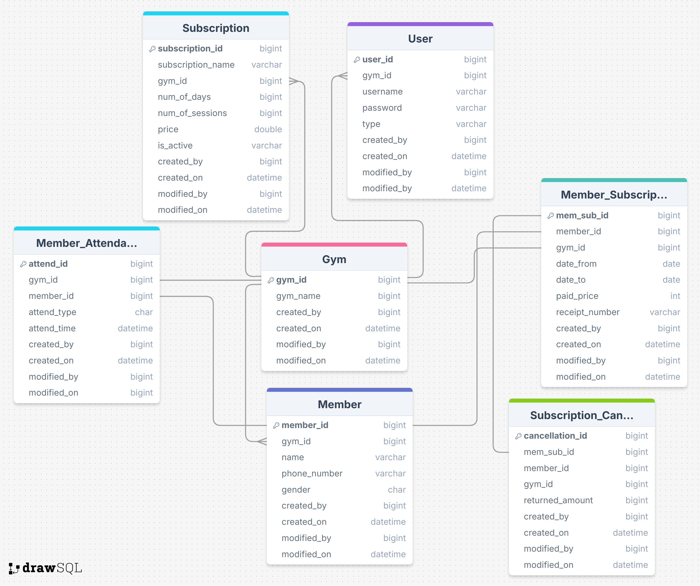

# The Gym System (Edition 1) 🏋️‍♂️

> **Note:** This project is currently under active development. Features and APIs are subject to change.

## Overview
The Gym System is a backend REST API designed to streamline the management of gym operations. Built with **Java** and **Spring Boot**, it serves as the core engine for handling members, subscriptions, staff, and attendance across multiple gym branches.

## Key Features 🚀
*   **Member Management:** Register and manage member profiles.
*   **Subscription Handling:** Track membership durations, renewals, and payment history.
*   **Multi-Gym Support:** Architecture supports managing multiple gym branches (e.g., Power Gym, Iron Factory).
*   **User Roles:** Role-based access for Admins, Trainers, and Staff.
*   **Attendance Tracking:** Log member check-ins and attendance history.
*   **Standardized API Responses:** Consistent JSON response structure for all endpoints.

## Tech Stack 🛠️
*   **Language:** Java
*   **Framework:** Spring Boot (Web, Data JPA)
*   **Database:** SQL (MySQL/H2 compatible)
*   **Build Tool:** Maven

## Getting Started
1.  Clone the repository.
2.  Configure your database settings in `application.properties`.
3.  Run the application using Maven:
    ```bash
    ./mvnw spring-boot:run
    ```

## Roadmap 🚧
- [x] Basic CRUD for Members and Subscriptions
- [x] Database Schema Design
- [ ] Authentication & Security (JWT)
- [ ] Reporting & Analytics
- [ ] Frontend Integration

---
*Developed by [Seif Mustafa]*

## Database Schema


